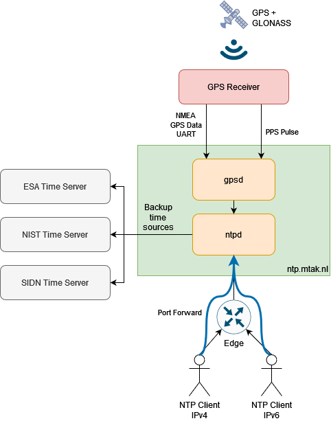

# ntp.mtak.nl NTP Server

ntp.mtak.nl is a public stratum 1 time service. The time source is a GPS module with PPS output.

ntp.mtak.nl is reachable over IPv4 and IPv6. It is also part of the [NTP Pool Project](https://www.ntppool.org/).

[NTP Project Server Page](https://www.pool.ntp.org/scores/2001:1c00:2509:8205::5)

# Details

The time service is powered by an [Adafruit Ultimate GPS Hat](https://www.adafruit.com/product/2324), connected to a [Raspberry Pi Zero 2 W](https://www.raspberrypi.com/products/raspberry-pi-zero-2-w/). 

## Stats

### Current NTP server status

### GPS Status

This visualization shows the location of the currently used GNSS satellites in the sky, as seen from the GPS receiver.

# Build

Clear view of the sky is required to receive GPS data. I solved this issue by placing the NTP server outside on the roof of the annex of my house, in a 3D printed waterproof case.The whole assembly is mounted on a street tile, so it clears the edge of the roof. This gives plenty of sky access and typically there are more than 15 GNSS (GPS + GLONASS) satellites in view. 

The case is 3D printed out of PETG (since it's UV and water resistant). I coated the inside of the case with epoxy to make it fully water proof. The blue board is the GPS Hat, the green board is the Raspberry Pi Zero 2 W. 

Power is fed in from the bottom of the pedestal (to prevent water ingress) from a 5V source coming from the house.

The power for the device is fed through a window with a flat cable, allowing the window to fully close.

The LED you see in the black box is the FIX output of the GPS Hat. This shows if the GPS Hat has a fix on a satellite.
